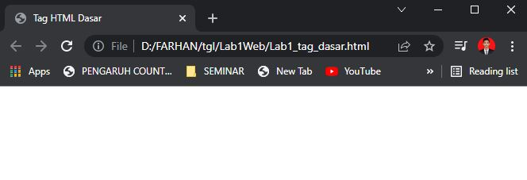
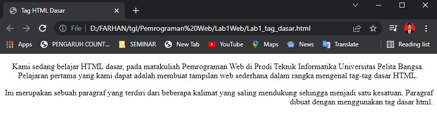

# Lab1Web
#
## Tugas Pemrograman Web - Pertemuan 2

Nama    : Muhammad Farhan Alfarizi 
NIM     : 312010210 
Kelas   : TI.20.B.1 

**Pada pertemuan 2 mata kuliah Web, saya akan melakukan beberapa perintah pada HTML**

- Menampilkan Tittle HTML pada browser  

 

1. **Membuat Paragraf**
 
pada poin ini saya akna membuat paragraf pada file HTML. Pada sintax p bertujuan untuk membuat paragraf baru. Berikut tampilannya. 

- **Perataan Paragraf**
 
Disini saya akan merubah perataan pada paragraf yang sudah tersedia, yaitu paragraf pertama menjadi rata tengah, paragraf kedua rata kanan. Berikut tampilannya.

